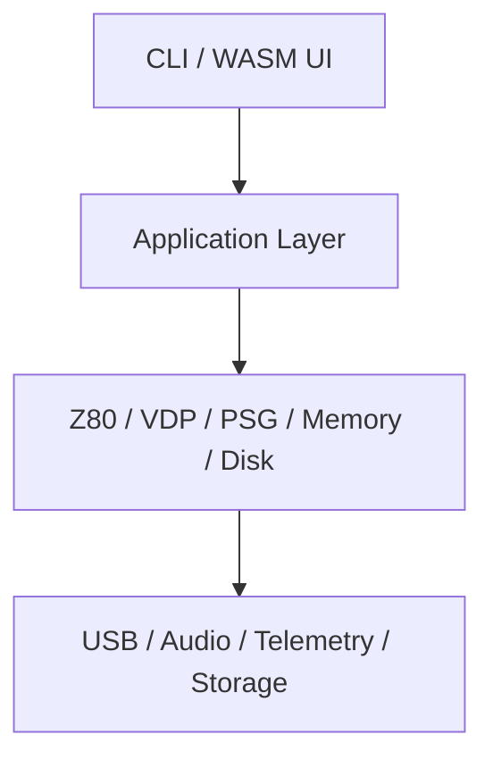

# Zenix: MSX2+ Emulator

**Zenix** is a modern, high-fidelity emulator for the MSX1, MSX2, and MSX2+ home computer systems.  
It is built in **C# with .NET 8**, featuring clean architecture, full observability, WebAssembly support, and a modular design inspired by Domain-Driven Design and Test-Driven Development.

> 💡 This project was collaboratively designed and iterated with **ChatGPT**.

---

## 🎮 Features

- 🎯 Cycle-accurate **Z80** CPU emulation
- 🖼️ Full **VDP** emulation (TMS9918A / V9938 / V9958)
- 🔊 AY-3-8910 **PSG** sound generator
- 💾 **WD2793** floppy controller and MSX-DOS disk support
- 🎮 Gamepad input (USB and browser-compatible)
- 🌐 WebAssembly frontend (Blazor WASM)
- 🧠 OpenTelemetry instrumentation (CPU, memory, video tracing)
- 🧪 Designed for testability, extensibility, and learning
- ⚙️ Optional hardware offload via USB-C (FPGA + ESP32) — modular and non-required

---

## 🚀 Getting Started

### 🖥️ Desktop (CLI)

```bash
dotnet run --project src/Zenix --rom path/to/game.rom --model MSX2+
```

### 🌐 Browser (WASM)

1. Open the WebAssembly build in your browser
2. Drag and drop a `.ROM` file into the UI
3. Use keyboard or gamepad to play!

---

## 🧱 Architecture

- 🧩 **Domain-Driven Design** with **Onion Architecture**
- 🧪 Built using **Test-Driven Development**
- 🧠 Includes visual and telemetry-based observability
- 📦 Configurable model, RAM/VRAM, ROM slots, and TGC



---

## 📦 Project Structure

```text
Zenix/
├── src/               # Main emulator core and frontend
├── tests/             # Unit and integration tests
├── docs/              # Markdown docs with Mermaid diagrams
├── .github/workflows/ # CI/CD (GitHub Actions)
├── VERSION            # Semantic version file
└── README.md          # This file
```

---

## 📄 License

This project is licensed under the [MIT License](LICENSE).

---

## 🤝 Contributing

Zenix is open to contributors — whether you're into emulation, .NET, HDL, Blazor, or observability, your help is welcome!

Please read `CONTRIBUTING.md` (coming soon) for guidelines.

---

## 🙏 Credits

- Designed and developed with the help of **ChatGPT**
- Inspired by the MSX, Z80, and retro computing communities
- Open-source emulator references: openMSX, BlueMSX, Fuse, MiSTer

---

## 🌟 Support the Project

If you enjoy Zenix, consider ⭐ starring the repo, opening issues, or sharing feedback!

