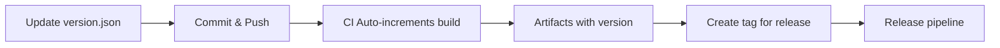

# DevOps Guide

This document describes the CI/CD pipeline, versioning strategy, and development operations for the Zenix project.

## Table of Contents

- [Overview](#overview)
- [Versioning Strategy](#versioning-strategy)
- [CI/CD Pipeline](#cicd-pipeline)
- [GitHub Workflows](#github-workflows)
- [Build System](#build-system)
- [Release Process](#release-process)
- [Development Workflow](#development-workflow)
- [Monitoring and Maintenance](#monitoring-and-maintenance)

## Overview

Zenix uses a modern DevOps approach with automated CI/CD pipelines, semantic versioning, and cross-platform builds. The entire system is built around GitHub Actions and provides comprehensive testing, building, and deployment automation.

### Key Features

- 🔄 **Automated CI/CD** - Full pipeline automation with continuous deployment
- 📦 **Semantic Versioning** - `major.minor.build` format with auto-increment
- 🌐 **Cross-Platform** - Windows, Linux, macOS support
- 🧪 **Comprehensive Testing** - Debug and Release configurations
- 🔒 **Security Scanning** - CodeQL analysis
- 📊 **Code Coverage** - Automated coverage reporting
- 🚀 **Continuous Deployment** - Automatic releases on main branch updates
- 🎯 **Smart Release Logic** - Intelligent change detection and release decisions
- 📝 **Auto Release Notes** - Generated from commit history
- ⚡ **Manual Override** - Workflow dispatch and skip options

## Versioning Strategy

### Version Format: `major.minor.build`

- **Major Version** (`X.y.z`) - Breaking changes, manually controlled
- **Minor Version** (`x.Y.z`) - New features, manually controlled  
- **Build Number** (`x.y.Z`) - Auto-incremented by CI pipeline

### Version Components

| Component | Description | Control | Example |
|-----------|-------------|---------|---------|
| Package Version | `major.minor.build` | Auto | `1.2.45` |
| Assembly Version | `major.minor.0.0` | Auto | `1.2.0.0` |
| File Version | `major.minor.build.0` | Auto | `1.2.45.0` |

### Version Management

#### Configuration File: `version.json`
```json
{
  "major": 1,
  "minor": 0
}
```

#### Update Scripts

**PowerShell (Recommended):**
```powershell
# Check current version
.\update-version.ps1

# Increment minor version (1.0 → 1.1)
.\update-version.ps1 -Increment minor

# Increment major version (1.1 → 2.0) 
.\update-version.ps1 -Increment major

# Set specific version
.\update-version.ps1 -Major 2 -Minor 5
```

**Windows Batch:**
```cmd
update-version.bat 1 2
```

### Version Lifecycle



## CI/CD Pipeline

### Pipeline Architecture

```
┌─────────────────┐    ┌─────────────────┐    ┌─────────────────┐    ┌─────────────────┐
│   Pull Request  │    │   Push to Dev   │    │  Push to Main   │    │   Tag Release   │
│                 │    │                 │    │                 │    │   (v*.*.*)      │
└─────────┬───────┘    └─────────┬───────┘    └─────────┬───────┘    └─────────┬───────┘
          │                      │                      │                      │
          ▼                      ▼                      ▼                      ▼
┌─────────────────┐    ┌─────────────────┐    ┌─────────────────┐    ┌─────────────────┐
│   PR Check      │    │   Full CI       │    │  Auto Release   │    │ Manual Release  │
│   Workflow      │    │   Workflow      │    │   Workflow      │    │   Workflow      │
└─────────────────┘    └─────────────────┘    └─────────────────┘    └─────────────────┘
                                              │                                      │
                                              ▼                                      │
                                    ┌─────────────────┐                             │
                                    │ Continuous      │◄────────────────────────────┘
                                    │ Deployment      │
                                    └─────────────────┘
```

### Build Matrix

| Platform | Runner | Configuration | Output |
|----------|--------|---------------|--------|
| Linux | ubuntu-latest | Debug + Release | Coverage Reports |
| Windows | windows-latest | Release | Windows Artifacts |
| macOS | macos-latest | Release | macOS Artifacts |

## GitHub Workflows

### 1. PR Check Workflow (`.github/workflows/pr-check.yml`)

**Triggers:** Pull requests to `main` or `develop`

**Purpose:** Fast validation of PR changes

**Features:**
- Debug and Release build validation
- Test execution with results upload
- Automated PR status comments
- NuGet package caching
- Fail-fast disabled for comprehensive testing

### 2. CI Workflow (`.github/workflows/ci.yml`)

**Triggers:** Push to `main` or `develop`, pull requests

**Purpose:** Comprehensive testing and artifact creation

**Jobs:**
- **Versioning** - Calculate version numbers
- **Build & Test** - Matrix testing (Debug/Release)
- **Windows Build** - Platform-specific artifacts
- **macOS Build** - Platform-specific artifacts

**Outputs:**
- Versioned build artifacts
- Code coverage reports
- Test results

### 3. Auto Release Workflow (`.github/workflows/auto-release.yml`)

**Triggers:** Push to `main` branch, manual workflow dispatch

**Purpose:** Continuous deployment with automatic release creation

**Features:**
- Smart change detection (source vs. documentation)
- Automatic version calculation and tagging
- Intelligent release notes generation
- Skip release option via commit message
- Manual release triggers with type selection

**Workflow Logic:**
- Analyzes changes to determine if release is needed
- Skips releases for documentation-only changes
- Honors `[skip release]` or `[no release]` in commit messages
- Creates releases for source code, test, or project file changes

### 4. Release Workflow (`.github/workflows/release.yml`)

**Triggers:** Tags matching `v*.*.*`

**Purpose:** Manual tag-based release creation and distribution

**Features:**
- Cross-platform self-contained executables
- Automatic GitHub release creation
- Release notes generation
- Multi-platform artifact upload

### 5. CodeQL Security Workflow (`.github/workflows/codeql.yml`)

**Triggers:** Push, PR, weekly schedule

**Purpose:** Security analysis and vulnerability detection

**Features:**
- C# code analysis
- Security and quality queries
- Automated security alerts

### 6. Dependabot Configuration (`.github/dependabot.yml`)

**Purpose:** Automated dependency updates

**Features:**
- Weekly NuGet package updates
- GitHub Actions updates
- Automatic PR creation

## Build System

### Project Structure

```
Zenix.sln                 # Solution file
├── src/
│   └── Zenix.csproj     # Main application project
└── tests/
    └── Zenix.Tests.csproj # Test project
```

### VS Code Tasks

Available in `.vscode/tasks.json`:

| Task | Command | Purpose |
|------|---------|---------|
| `build-debug` | `dotnet build --configuration Debug` | Debug build |
| `build-release` | `dotnet build --configuration Release` | Release build |
| `test` | `dotnet test tests/Zenix.Tests.csproj` | Run all tests |
| `test-debug` | `dotnet test --configuration Debug` | Debug test run |
| `test-release` | `dotnet test --configuration Release` | Release test run |

### Build Properties

The build system automatically applies version properties:

```xml
<PropertyGroup>
  <!-- Applied by CI -->
  <Version>1.0.123</Version>
  <AssemblyVersion>1.0.0.0</AssemblyVersion>
  <FileVersion>1.0.123.0</FileVersion>
  
  <!-- Project metadata -->
  <AssemblyTitle>Zenix MSX Emulator</AssemblyTitle>
  <AssemblyDescription>A modern MSX computer emulator</AssemblyDescription>
  <AssemblyCompany>Zenix Project</AssemblyCompany>
</PropertyGroup>
```

## Release Process

Zenix supports both **automatic** and **manual** release processes to accommodate different development scenarios.

### Automatic Release Process (Recommended)

#### 1. Feature Development & Merge
```bash
# Create feature branch
git checkout -b feature/new-feature

# Develop and test
# ... code changes ...

# Create pull request
# PR Check workflow validates changes

# Merge to main
git checkout main
git merge feature/new-feature
git push origin main
# → Auto-release triggered if source code changed
```

#### 2. Release Logic
The auto-release workflow intelligently determines when to create releases:

- ✅ **Creates release**: Source code, tests, or project files changed
- ⏭️ **Skips release**: Only documentation changes  
- 🚫 **Manual skip**: Add `[skip release]` or `[no release]` to commit message

#### 3. Automatic Process
1. **Change Detection** - Analyzes modified files
2. **Version Calculation** - Uses `major.minor.build` format with auto-increment
3. **Release Notes** - Generated from commit history since last release
4. **Build & Test** - Validates code before release
5. **Asset Creation** - Cross-platform binaries
6. **GitHub Release** - Automatic creation with proper tagging

### Manual Release Process

#### 1. Version Update (Optional)
```bash
# Update version for new release
.\update-version.ps1 -Increment minor

# Commit version change
git add version.json
git commit -m "Bump version to 1.1"
git push origin main
```

#### 2. Manual Release Trigger
**Option A: Workflow Dispatch**
1. Go to GitHub Actions → "Auto Release"
2. Click "Run workflow"
3. Select release type: auto/patch/minor/major
4. Automatic release creation

**Option B: Tag-based Release**
```bash
# After CI completes, get the build number from artifacts
# Example: If CI run #45 completed, the version is 1.1.45

# Create and push release tag
git tag v1.1.45
git push origin v1.1.45

# Release workflow automatically:
# - Creates GitHub release
# - Builds cross-platform binaries
# - Uploads release assets
```

### Release Control Options

#### Skip Automatic Release
```bash
git commit -m "Update documentation [skip release]"
# or
git commit -m "Fix typo [no release]"
```

#### Force Release for Documentation
```bash
# Use manual workflow dispatch to force release
# even for documentation-only changes
```

### Release Artifacts

Each release provides:

- **Windows**: `zenix-win-x64.zip`
- **Linux**: `zenix-linux-x64.tar.gz`
- **macOS**: `zenix-macos-x64.tar.gz`

All binaries are self-contained and don't require .NET installation.

## Development Workflow

### Branch Strategy with Continuous Deployment

```
main         ──●────●────●──  (Production releases - Auto CD)
              ╱      ╱      ╱
develop   ──●────●────●────   (Integration branch)
           ╱    ╱    ╱
feature ──●    ╱    ╱        (Feature branches)
release    ──●────╱          (Release preparation - Optional)
```

### Continuous Deployment Workflow

#### Standard Development Flow
1. **Feature Development**
   - Branch from `develop`
   - Implement feature with tests
   - Create PR to `develop`
   - PR Check validates changes

2. **Integration & Testing**
   - Merge to `develop`
   - CI pipeline validates integration
   - Manual testing and validation

3. **Production Deployment**
   - Merge `develop` to `main`
   - **Auto-release triggers automatically**
   - Cross-platform binaries created
   - GitHub release published

#### Alternative Workflow (Direct to Main)
1. **Feature Development**
   - Branch from `main`
   - Implement feature with tests
   - Create PR to `main`
   - PR Check validates changes

2. **Direct Deployment**
   - Merge to `main`
   - **Auto-release triggers immediately**
   - Production release created

### Workflow Steps Details

#### Continuous Deployment Steps
1. **Feature Development**
   - Branch from `develop` (or `main`)
   - Implement feature with comprehensive tests
   - Create PR with descriptive commit messages
   - PR Check validates changes automatically

2. **Code Review & Integration**
   - Team reviews PR for code quality
   - Merge to target branch (`develop` or `main`)
   - CI pipeline validates integration

3. **Automatic Release (Main Branch Only)**
   - Auto-release analyzes changes
   - Creates release if source code modified
   - Generates release notes from commits
   - Builds and publishes cross-platform binaries

#### Manual Version Control (When Needed)
1. **Version Bump** (Optional)
   - Use `.\update-version.ps1 -Increment minor` for feature releases
   - Use `.\update-version.ps1 -Increment major` for breaking changes
   - Build number always auto-increments

2. **Manual Release Triggers**
   - Workflow dispatch for immediate releases
   - Tag-based releases for specific versions
   - Emergency releases bypassing normal flow

4. **Release Deployment**
   - Merge to `main`
   - Create version tag
   - Automated release creation

### Quality Gates

| Stage | Check | Action |
|-------|-------|--------|
| PR | Build + Test | Block merge if failed |
| Merge to Main | Auto-release + CD | Create release if source changed |
| Manual Release | Security scan | Alert if issues found |
| All Releases | Cross-platform build | Ensure compatibility |

### Continuous Deployment Benefits

#### Development Efficiency
- **Faster Feedback**: Immediate releases for bug fixes and features
- **Reduced Manual Work**: No manual version tagging or release creation
- **Consistent Process**: Same release process every time
- **Lower Risk**: Smaller, more frequent releases

#### Quality Assurance
- **Automated Testing**: All releases are tested before deployment
- **Version Consistency**: Automatic version management prevents conflicts
- **Release Notes**: Comprehensive documentation for every release
- **Rollback Capability**: Easy to identify and revert problematic releases

#### Team Collaboration
- **Clear History**: Every change is tracked and documented
- **Release Visibility**: Team knows what's in each release
- **Skip Options**: Developers can control when releases happen
- **Manual Override**: Emergency releases when needed

## Monitoring and Maintenance

### Automated Monitoring

- **Dependabot** - Weekly dependency updates
- **CodeQL** - Weekly security scans
- **Build Status** - Immediate notification on failures

### Maintenance Tasks

#### Weekly
- Review Dependabot PRs
- Check security alerts
- Monitor build performance

#### Monthly
- Review CI/CD metrics
- Update documentation
- Evaluate pipeline optimizations

#### Quarterly
- Review and update GitHub Actions versions
- Evaluate new DevOps tools
- Performance benchmarking

### Troubleshooting

#### Common Issues

**Build Failures:**
```bash
# Check specific job logs in GitHub Actions
# Common causes:
# - Missing dependencies
# - Version conflicts
# - Test failures
```

**Version Issues:**
```bash
# Verify version.json format
cat version.json

# Check CI environment variables
# BUILD_NUMBER should be available
```

**Release Problems:**
```bash
# Ensure tag format is correct: v1.2.3
git tag --list "v*"

# Check release workflow permissions
# GITHUB_TOKEN needs release creation permissions
```

### Performance Metrics

| Metric | Target | Monitoring |
|--------|--------|------------|
| PR Check Time | < 5 minutes | GitHub Actions |
| Full CI Time | < 15 minutes | GitHub Actions |
| Test Coverage | > 80% | Codecov |
| Security Issues | 0 critical | CodeQL |

### Contact and Support

For DevOps-related issues:

1. Check [GitHub Actions](https://github.com/zenix/zenix/actions) status
2. Review this documentation
3. Create issue with `devops` label
4. Contact maintainers for urgent issues

---

*This document is automatically updated as part of the CI/CD pipeline. Last updated: $(date)*
