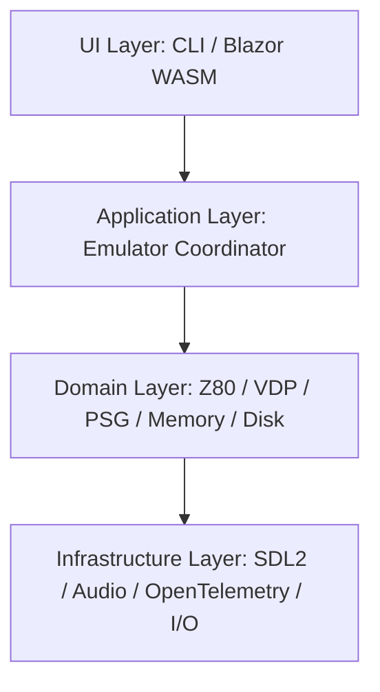

# 🧱 Architecture – Zenix Emulator

This document provides a high-level overview of the architecture of the Zenix MSX emulator, including its major components, layered structure, and integration points.

---

## 🧠 Architectural Overview

Zenix follows **Onion Architecture** and **Domain-Driven Design (DDD)** principles. The emulator is built as a modular, testable, and extensible application that supports both desktop and web platforms.

---

## 🧩 Layered Architecture

- **UI Layer**: Includes CLI frontend and Blazor WebAssembly-based browser UI.
- **Application Layer**: Coordinates emulation steps, input polling, timing, and rendering.
- **Domain Layer**: Pure logic — Z80 CPU, VDP (TMS9918A / V9938 / V9958), PSG, memory mapper, slot logic.
- **Infrastructure Layer**: Handles rendering, audio output, telemetry, file I/O, gamepad polling, etc.

---

## 🔌 Optional Hardware Acceleration (High-Level)

Zenix optionally supports offloading CPU, VDP, and audio subsystems to an external hardware engine over USB-C. This integration is modular and fallback-safe — the default runtime is software-based.

---

## ⚙️ Cross-Platform Deployment Targets

| Target | Description |
|--------|-------------|
| **Desktop (.NET CLI)** | Native performance, full debug and dev tools |
| **Blazor WebAssembly** | Runs in browser with `<canvas>` and gamepad input |
| **Optional Embedded Mode** | FPGA + microcontroller integration (future) |

---

## 🧪 Instrumentation and Observability

Zenix includes OpenTelemetry integration to emit spans for:
- Instruction execution
- VDP rendering
- Memory reads/writes
- Frame timing
- Input/output state

Telemetry can be viewed locally or exported to systems like Jaeger or Zipkin.

---

## 🔁 Configuration and Modularity

Zenix supports loading system configurations from CLI flags or JSON, enabling:
- MSX1, MSX2, MSX2+ models
- Slot and RAM configurations
- Audio and display settings
- Enabling/disabling optional FPGA offload

